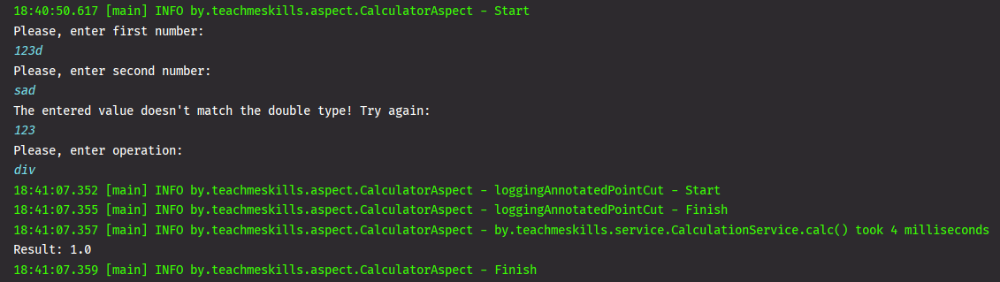

# TeachMeSkills HOMEWORK AOP

## Spring, AOP, Maven training.

--- 

## Table of contents

### 1. [Task](#task)

### 2. [How it works?](#how-it-works)

--- 

### Task

> Make an annotation and its implementation on aspects using the `Around` advice.
> It should give the time of working out the method on which it is applied.
> Output in the log file. Embed it in Calculator from the previous task.
> Use `LocalDateTime`. Collect statistics of several launches.

---

### How it works?

#### Example

